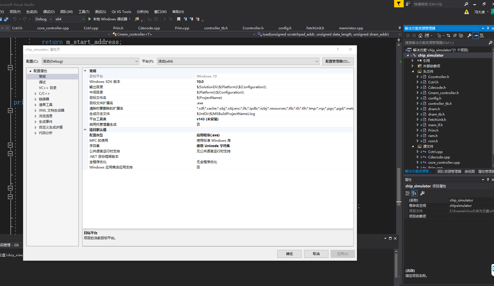

# chip_simulator

本项目为《测控技术与仪器设计与应用探索课》类脑计算方向的课程实验。本项目是基于SystemC的类脑计算芯片功能核的简单行为级仿真器。


## 实验目的

1. 理解芯片的组成和运行流程
2. 理解存储在芯片中的重要性
   1. DRAM与SRAM的区别：延迟、容量、能耗、价格
   2. 是否使用DRAM的区别                                                                
3. 理解芯片中计算和存储的关系


## 实验内容

1. 编写原语实现特定功能
2. 根据实验指导书调整存储的大小、数量
3. 根据实验指导书增加一条矩阵乘原语
4. 在现有芯片的基础上通过调用原语或修改芯片实现卷积功能，对比不同方案的效果（可替代大作业？）


5. 
## visual studio环境安装
进入doc文件夹，按照readme步骤完成环境安装

## Quick start
按照链接<https://blog.csdn.net/qq1713802040/article/details/124831253>，安装git。

安装完成后，鼠标右键会出现 Git GUI Here 以及 Git Bash Here，前者是启用可视化界面，后者是进入终端。我们一般使用后者，在终端内进行操作。

首次进入终端可能需要配置git 用户信息。

```
2 . 设置
2.1 设置用户名
git config --global user.name "username"
2.2 设置邮箱 (没有双引号)
git config --global user.email useremail@qq.com 
3 . 查看用户名和密码
git config user.name
git config user.email
4 . 查看其他配置信息(git设置列表)
git config --list 
```

其中用户名和邮箱为名字 + 学校的邮箱

其他一些有用的git命令
```
git branch 查看当前分支
git branch home 创建home分支
git status 查看当前分支文件状态
git add .   将新增的，修改的文件都加入暂存区
git status 再次查看状态
git commit -m "完成了开发"     完成本地的提交
git push origin home  将本地的 home 分支推送到远程仓库进行保存
git checkout master 切换到master分支
git merge home  将本地的 home 分支合并到本地的 master 分支
git branch -d home 删除home分支

```

如何在本机关联仓库

```
打开Git Bash Here
git clone https://git.tsinghua.edu.cn/zhengc22/chip_simulator.git
默认在master分支 创建自己分支
git branch 名字
切换到你的分支
git checkout 名字
添加修改(注意 . 和add之间有空格)
git add .
添加提交注释
git commit -m "第一次提交代码"
提交远程服务器
git push origin 名字
```
利用visual studio打开项目，根据大家安装版本不一致，可能需要在项目属性页进行一些修改

界面右侧解决方案管理器，chip_simulator右键属性，打开项目属性页。需要更改的是Windows SDK 版本和平台工具集，下拉选择默认项即可。

## tutorial
如何用systemC实现一个最简单的半加器模块？

按照Quick Start 配置好本地仓库

      git checkout tutorial

切换到tutorial 分支


