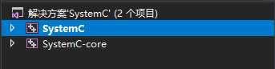
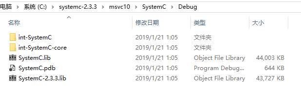
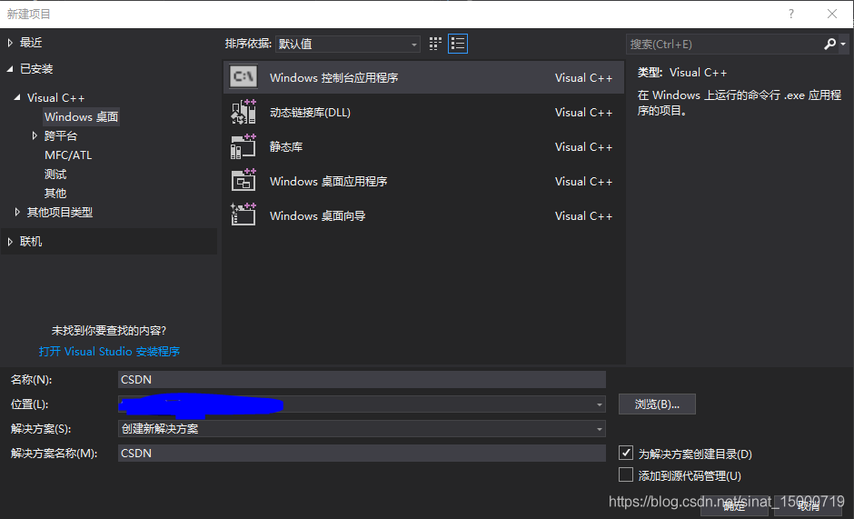
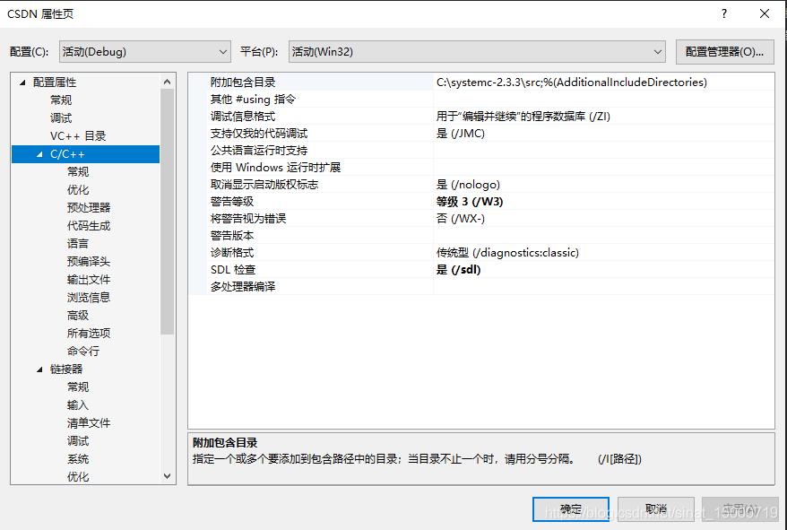
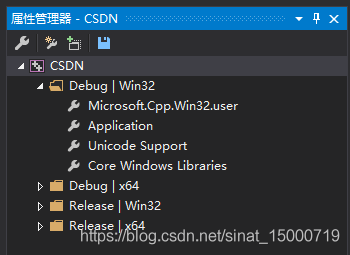
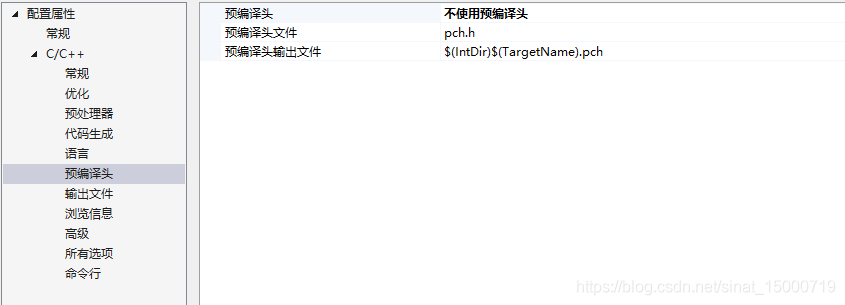
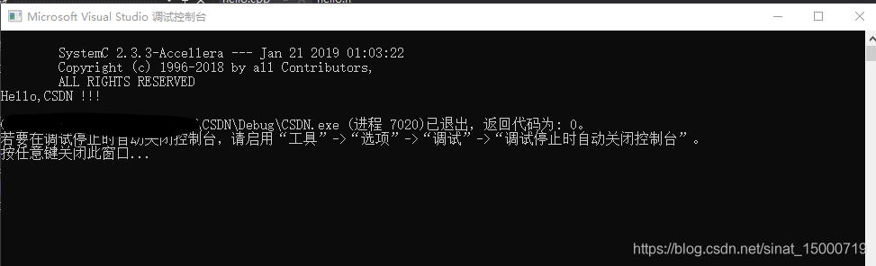
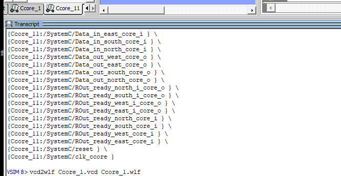
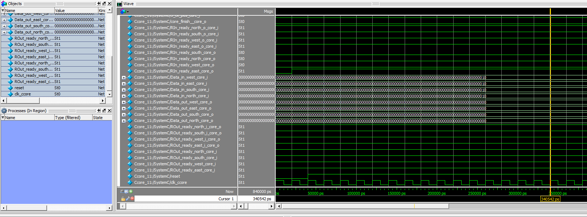

# TianjiX_systemC

## 运行环境

***Visual Studio 2017 + modelsim（仿真）+ QT5***

### Visual Studio安装
这里我提供了一个Visual studio 安装教程，可以从公众号： 小白自习室 回复028 获取百度网盘

链接：<https://pan.baidu.com/s/1QadHStZFNTGrAw97e5jnOA?pwd=xnxl> 
提取码：xnxl 
--来自百度网盘超级会员V8的分享

安装包的解压密码：520

### 安装modelsim

modelsim安装太久远了，找不到安装破解说明了，其实只要有能打开vcd波形仿真文件的仿真器都是可以的


### 在Visual Studio中安装systemC库

#### systemC下载
SystemC库的源码是可以直接下载到的，下载链接：<https://accellera.org/downloads/standards/systemc>,链接里有各个版本的源代码，在这里我们用目前最新的2.3.3版本。

#### 编译库文件
 
安装好VS2017后，首先把下载好的解压，在这里我放在C盘根目录下，在VS中打开`C:\systemc-2.3.3\msvc10\SystemC`  下的 `SystemC.sln`，点击生成开始编译



编译好之后会提示你编译成功，至于中间出现的warning可以忽略，此时你可以在`C:\systemc-2.3.3\msvc10\SystemC\Debug`文件下找到编译完成的库。



#### 项目配置

新建名为CSDN的控制台项目



右击CSDN打开属性页




接下来做如下设置：

*C/C++：*

常规>>附加包含目录：添加 C:\systemc-2.3.3\src 项
语言>>启用运行时类型信息：选择“是”
命令行>>添加 /vmg /D_CRT_SECURE_NO_DEPRECATE

*链接器：*

常规>>附加库目录：添加 C:\systemc-2.3.3\msvc10\SystemC\Debug 项
输入>>附加依赖项：添加 SystemC.lib

以上，项目配置就基本完成了，不过每次你创建SystemC项目都要作如上配置比较麻烦，所以建议用如下方法一劳永逸，打开视图>>属性管理器，在左侧窗口会出现如下窗口，打开`Microsoft.Cpp.Win32.user`，对其做以上项目配置即可。



#### 环境测试
环境搭好后，在这里我们写一段简单程序进行测试：
`hello.h`

```
//hello.h
#ifndef  _HELLO_H
#define _HELLO_H
#include "systemc.h"

SC_MODULE(hello)
{
  SC_CTOR(hello) 
  { 
    cout << "Hello,CSDN !!!" << endl;
  }
};
#endif
```

`hello.cpp`

```
//hello.cpp
#include "hello.h"
int sc_main(int argc, char * argv[])
{
  hello  h("hello");
  return 0;
}

```

注意 在调试前应该将`hello.cpp`的预编译头选项修改为如下图所示：



开始调试，测试结果如下：




## 如何利用modelsim查看波形

在运行`tb_Ccore.cpp`后会产生相对应的vcd文件，可以利用modelsim转换vcd文件成wlf文件（在modelsim下方的命令行中输入）

```
vcd2wlf Ccore_1.vcd Ccore_1.wlf
vsim -view Ccore_1.wlf
```





## QT VS2017 安装
https://blog.csdn.net/m0_62083249/article/details/124700712

## systemC代码规范

***1. 明确子模块的所有IO方向以及各自位宽***
    
     -- _i结尾表示输入，_o 结尾表示输出

     -- 输出信号不能再被赋值 （不能多重驱动）

     -- 模块的输入的是wire， 输出是reg

     -- reg只能被wire赋值，并不能赋值给其他信号 

     -- 明确输入输出的位宽，以及是否符号位扩展，（地址，选通均为无符号数，除了数据流，控制流应该都是bv，无符号扩展类型）

     -- 模块的输出不能直连到模块输入，产生自震荡（满足第二条则无需检查）


***2. 区分时序和组合逻辑电路***

     --  用 Sequential_logic  Combinational_logic 区分模块逻辑，并由敏感信号驱动

     --  其中 Sequential_logic 中只包含reg， reg的更新并且作为 Combinational_logic 的输出

     --  Sequential_logic 由clk驱动， Combinational_logic由模块的输入（如果存在非reg输出的模块输入） 和 子模块的输出（如果本模块存在单独的组合逻辑）

     --   只能对reg进行初始化，而不能对wire进行初始化

     --   wire变量如果作为右值 不能出现在左值的前面（尤其不能出现++）

     --   class 中不应该含有除了reg和sensitive signal之外的成员变量。其余变量应该都作为函数局部变量

     --  函数的局部变量不应该初始化（除非作为else的缺省赋值，不建议）

     --  if else / case语句不能存在缺省赋值（对于数组中某几位的赋值，暗含了对其他位的缺省赋值）
 
     --  sc_in 信号需要read()进行赋值，sc_out和signal信号只能被write()赋值，并且不能成为左值。

    --  规范化组合逻辑的级数，否则产生关键路径的大量延迟（Router_trans的仲裁部分 5级逻辑造成天机X的关键路径）

***3. 区分控制流（寄存器）和数据流（Mem）***

    --  Mem需要成为单独的一拍，其中输入尤其是(we写使能)需要尤reg驱动，否则芯片会产生数据流异常（存储异常）

***4. 顶层模块不应该有组合逻辑***

     -- 用实例化模型，代替函数调用，顶层模块不存在实现函数

***5. 所有模块的输出均应该以寄存器输出***

    --  增加芯片的抗毛刺能力（必须且必要），后端综合的规范（提升综合后芯片实际性能）

    --  Mem模块写使能造成已知肯定存在的bug（严重等级：一般）


***6. 各子模块之间的交互规范***

     -- 各模块间的交互 Axon 与 Soma交互（行流水）、Soma 与 Router交互（数据流水）

     -- Router 与 Router_trans交互（未定义，数据发送使能） Router_trans 与 Router_trans交互（未定义，路由使能）

     -- 明确交互信号， 分析时序路径（Router_trans中单cycle干的事实在太多了，buf 读 buf 写 仲裁）


