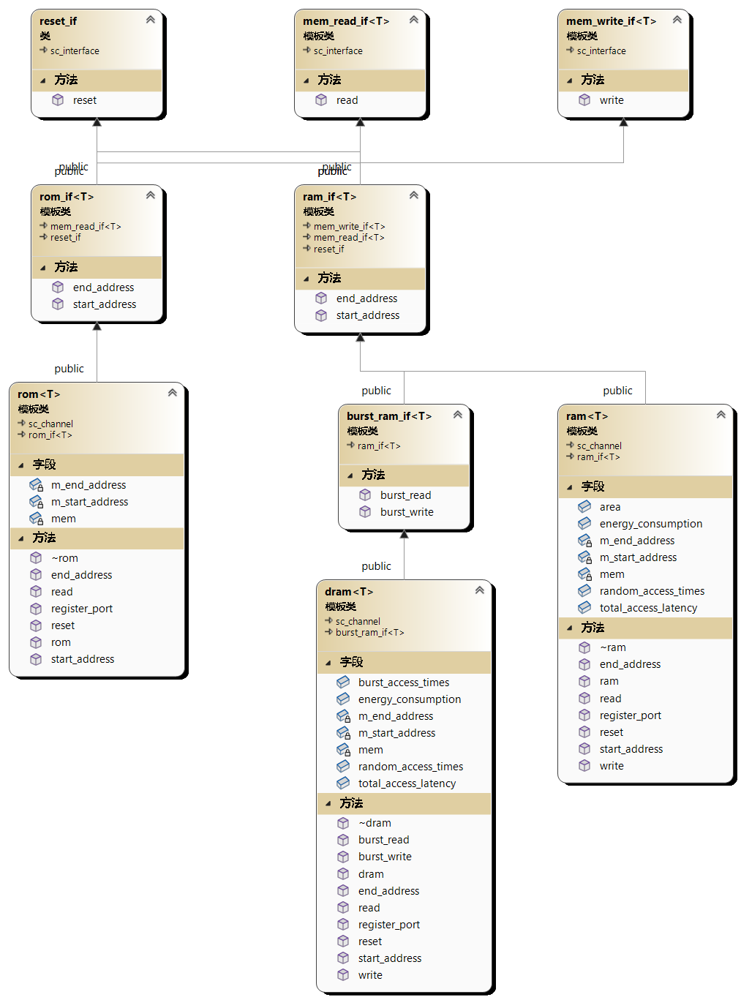

# 仿真器架构

## 文件结构

### 根目录

以 `dahu` 分支为例，下图是其项目的根目录


`chip_simulator/` 中包含本项目的主要代码；

`doc/` 中包含文档信息；

`libs/` 中包含在助教电脑上编译好的System C库，但是由于每个人的系统版本、VS版本等不完全相同，这个库无法直接使用，大家可以在项目属性中将引用这个文件夹的相对路径都改为自己电脑上的路径；

`memristor/` 中包含忆阻器仿真器的一些代码和说明；

`chip_simulator.sln` 是VS解决方案文件，双击即可打开项目；

`指令集V1.xlsx` 包含了助教预先设计的7条原语的详细字段分配，可供参考。

### `chip_simulator/` 中的代码文件

项目的代码文件可以分为以下几个部分：

#### 存储类代码

已经封装好的存储类，包括一些可以直接使用的System C接口和通道

```shell
mem_if.h: 接口类
ram.h: SRAM 通道类
rom.h: ROM 通道类
dram.h: DRAM 通道类
dram_tb.h: DRAM 测试文件
```

#### Trace and Profile 代码

这一部分文件用于跟踪仿真的运行，统计仿真中的某些指标；在实验中可以完全忽略

```
Event_engine.h
Event_engine.cpp
Trace_event.h
Trace_event.cpp
Trace_event_queue.h
```

#### 仿真器的实现代码

这一部分文件是仿真器的具体实现

下面的文件是仿真器的主要实现代码

```
CMemristor.h	
Ccontroller.cpp
Ccontroller.h
Cctrl.cpp
Cctrl.h
Cdecode.cpp
Cdecode.h
Cmem_controller.h
FetchUnit.h
controller_tb.h
core_controller.cpp
```

另外，“原语”这一概念也被封装成类，方便代码中的使用

```
Prim.cpp
Prim.h
```

#### 配置文件

文件中定义了影响仿真器运行的一些参数

```
config.h
```


## 存储类和原语类

### 存储类

#### 使用方法

##### 1. 创建存储

```c++
 // 创建数据类型为sc_bv，位宽为PORT_WIDTH，起始地址0，结束地址10000的DRAM存储器
dram<sc_bv<PORT_WIDTH> > offchip_dram("offchip_dram", 0, 10000);

// 创建数据类型为sc_bv，位宽为PORT_WIDTH，起始地址0，结束地址100的SRAM存储器
ram<sc_bv<PORT_WIDTH> > prim_buffer("prim_buffer", 0, 100);
```

```c++
// SRAM存储器(ram.h)中定义了两个接口
transfer_status read(unsigned address, T& data);
transfer_status write(unsigned address, T& data);

// DRAM存储器(dram.h)中定义了四个接口
transfer_status read(unsigned address, T& data);
transfer_status write(unsigned address, T& data);
transfer_status burst_read(unsigned int address, unsigned int length, T* &data);
transfer_status burst_write(unsigned int address, unsigned int length, T* &data);
```

##### 2. 创建存储端口

```c++
// 假设在名为Cmem_controller的sc_module中声明了下面两个公有成员
// 可以读写DRAM的端口
sc_port<burst_ram_if<T> > dram_port;

// 只能写的端口
sc_port<mem_write_if<T> > prim_buffer_port;
```

##### 3. 连接存储和存储端口

```c++
// 实例化Cmem_controller对象
Cmem_controller mem_ctrl;

// 连接dram_port和DRAM存储器
mem_ctrl.dram_port(offchip_dram);

// 连接prim_buffer_port和SRAM存储器
mem_ctrl.prim_buffer_port(prim_buffer);
```

##### 4. 存储访问

```c++
// 在Cmem_controller的成员函数中，可以通过存储端口来访问存储器
// 使用时，存储端口表现得就像是存储器的指针

// DRAM的Burst读写
dram_port->burst_read(dram_addr, data_length, load_data);
dram_port->burst_write(dram_addr, data_length, store_data);

// SRAM的读写
prim_buffer_port->write(scratchpad_addr - (this->m_end_address) + i, load_data[i]);

// 除了可以通过端口访问，在Cmem_controller类内声明了存储器的指针并实例化存储器后，也可以直接调用存储器的接口
ram<T>* Scratchpad0;  // 成员变量
Scratchpad0 = new ram<T >("Scratchpad0", m_start_address, m_end_address, sync_event, Trace_event_queue_Cmem);  // 构造函数中
Scratchpad0->read(scratchpad_addr + i, store_data[i]);  // 其他成员函数中
```


#### 继承关系

存储类之间的关系如下：



### 原语类

#### 使用方法

原语类的作用主要是使原语更加可读，原语和原语类之间的相互转化其实就是编码和解码的过程。

所有原语类都继承自 `PrimPacket` 类，原语类必须包含的两个成员变量为 `type_name` 和  `prim_id_code`， `type_name` 用于快速判断原语的类别，  `prim_id_code` 是原语的唯一标识。

```c++
class PrimPacket
{
public:
	PrimPacket();
	~PrimPacket();
	PrimPacket& operator=(const PrimPacket& rhs);
	bool operator==(const PrimPacket& rhs) const;
	friend ostream& operator<<(ostream& file, const PrimPacket& prim);
	friend void sc_trace(sc_trace_file*& tf, const PrimPacket& prim, std::string nm);
	friend sc_bv<PORT_WIDTH> convertPrim2Code(const PrimPacket& p);
public:
	std::string type_name;
protected:
	sc_bv<PORT_WIDTH> prim_id_code;
};
```

定义新原语类的代码示例如下（Load）：

```c++
class Prim_Load : public PrimPacket {
public:
	Prim_Load(unsigned scratchpad_addr = 0, unsigned length = 0, unsigned dram_addr = 0)
		: Scrachpad_Addr(scratchpad_addr), Data_Length(length), Dram_Addr(dram_addr)
	{
		type_name = "Load";
		this->prim_id_code.range(3, 0) = "0010";
         this->prim_id_code.range(19, 4) = sc_bv<16>(scratchpad_addr);
		this->prim_id_code.range(35, 20) = sc_bv<16>(length);
		this->prim_id_code.range(115, 84) = sc_bv<32>(dram_addr);
	}	
public:
	unsigned Scrachpad_Addr;
	unsigned Data_Length;
	unsigned Dram_Addr;
};
```

在芯片的存储中只能存储二进制编码，这种表示方式对人并不友好。在写原语时，应先生成对应原语类的实例，然后调用 `convertPrim2Code` 方法得到二进制编码：

```c++
// controller_tb.h中
sc_bv<PORT_WIDTH> prim1 = convertPrim2Code(Prim_Load(0, 1, 20)); 
```

在译码时，需要将二进制编码转换回原语类：

```c++
// Cdecode.cpp中
sc_bv<PORT_WIDTH> prim_temp = this->prim_code_in.read(); // 读取二进制编码
short type_code = prim_temp.range(3, 0).to_uint(); // 判断原语类别
switch (type_code)
{
case 0b0010:
{
    this->mem_prim_out.write(
        // 转变为原语类
        Prim_Load(
            prim_temp.range(19, 4).to_uint(),
            prim_temp.range(35, 20).to_uint(),
            prim_temp.range(115, 84).to_uint()
        )
    );
    this->prim_type_code.write(0b0010);

    break;
}
```

## 仿真器的架构与运行流程

这一部分讲解[仿真器的实现代码](#仿真器的实现代码)的具体架构

现有的代码框架如下图。


`core_controller.cpp` 中的 `sc_main()` 函数是仿真器的入口

**System C** 可执行文件的执行(Execution)过程分为目标描述（Elaboration）、初始化（Initialization）和仿真（Simulation）三个阶段。在 `sc_start()` 之前是目标描述阶段， `sc_start()` 开始进入初始化和仿真阶段。

初始化和仿真阶段的过程如下：

* `controller_tb` 模块的 `test_mem_ctrl()` 函数在初始化时开始运行，并控制整个仿真流程

  1. 写入数据和原语

  2. 产生reset信号的上升沿，重置所有模块

  3. 产生core_idle信号的下降沿，启动核内 `Controller` 模块中 `Cctrl` 模块中的 `ctrl_status_trans` 线程

     ……