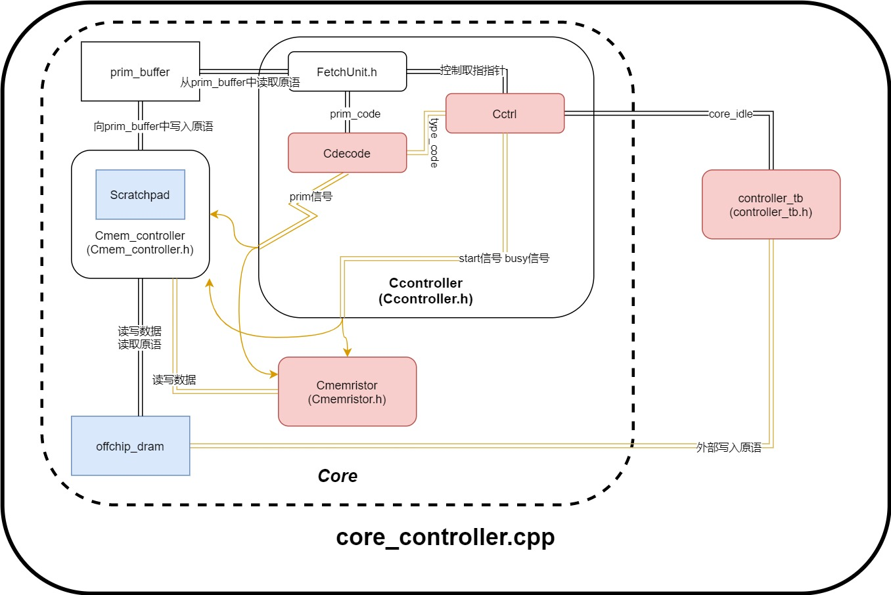
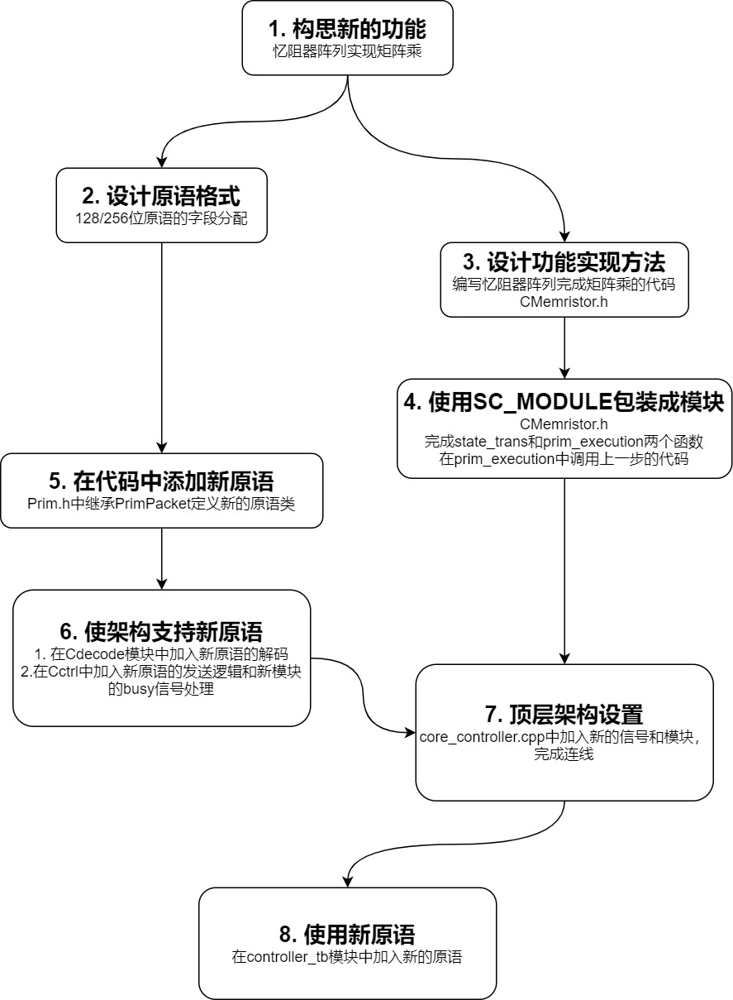
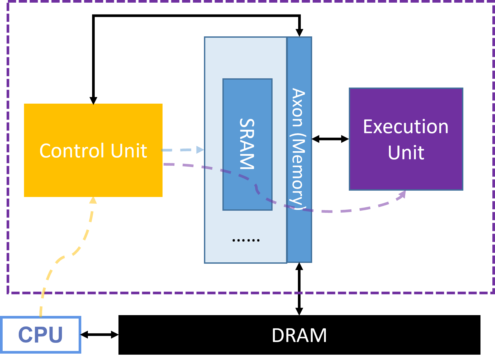

# 类脑计算芯片仿真设计实践

## 实验目的

1. 理解芯片的组成和运行流程

2. 理解芯片中的存储（DRAM与SRAM） 

3. 理解芯片中计算和存储的关系

 

## 实验内容（二选一）

### 1.  芯片架构设计

在C++开发环境下，根据自己设计的芯片架构、原语，基于现有框架完成一套芯片模拟器的开发，在模拟器中实现一个神经网络，并评估架构的优势与不足。

现有的代码框架如下图。其中红色的模块是添加原语时需要重点关注的模块；蓝色模块则是架构探索时可以直接修改的模块。



芯片架构设计体验实验分为两个部分：一是**功能实现**，主要工作是在现有框架下加入新原语，使芯片（核）实现新的功能（矩阵乘、卷积、ReLU、LIF等）；二是**架构探索**，主要工作是在现有框架下修改DRAM和SRAM的大小，探索这种变化对功能实现和芯片性能的影响。

#### 1.1  功能实现：如何添加一条新原语

添加一条新原语的流程如下：



具体的需要修改的代码可以参考第13周课程PPT。

#### 1.2  架构探索（选做）

##### 1.2.1 调整存储容量

在添加计算原语的基础上，可以对**存储**进行修改，观察其影响。

目前的对架构影响较大的存储有两块，一是片外的DRAM，二是片上的SRAM。

片外DRAM的大小可以在```core_controller.cpp```中修改：

```c++
dram<sc_bv<PORT_WIDTH> > offchip_dram("offchip_dram", 0, 10000,sync_event, trace_event_queue_tb);
```

如果把DRAM看作一个数组，那么 ```sc_bv<PORT_WIDTH>``` 就是数组中的数据类型（DRAM的位宽），`0` 代表数组的起始编号（DRAM的起始地址），`10000` 代表数组的结束编号（DRAM的结束地址）。DRAM的存储空间大小可以简单表示为
$$
DRAM\ capacity=width \times (end\ address-start\ address)
$$
片上SRAM的大小也在```core_controller.cpp```中修改：

```c++
Cmem_controller<sc_bv<PORT_WIDTH> > mem_ctrl("mem_crtl", 0, 1000,sync_event,trace_event_queue_tb);
```

`Cmem_controller` 内部有一块SRAM，通过在`Cmem_controller` 的构造函数中指定位宽、起始地址和结束地址，可以调整SRAM的大小。

现有框架的实现较为简单，将存储的位宽与指令长度直接绑定（`PORT_WIDTH` 定义在 `config.h` 文件中）。所以建议调整存储容量时只调整深度。

##### 1.2.2 查看性能情况

在 `core_controller.cpp` 的最后，程序会自动输出存储造成的开销。

```c++
std::cout << "DRAM random access times: " << dram<sc_bv<PORT_WIDTH> >::random_access_times << std::endl;
std::cout << "DRAM burst access times: " << dram<sc_bv<PORT_WIDTH> >::burst_access_times << std::endl;
std::cout << "DRAM area: " << dram<sc_bv<PORT_WIDTH> >::area << std::endl;
std::cout << "DRAM refresh energy: " << dram<sc_bv<PORT_WIDTH> >::area * tb.simulater_time * RAM_REFRESH_POWER<< std::endl;
std::cout << "DRAM total access latency: " << dram<sc_bv<PORT_WIDTH> >::total_access_latency << std::endl;
std::cout << "DRAM energy consumption: " << dram<sc_bv<PORT_WIDTH> >::energy_consumption << std::endl;

std::cout << "SRAM random access times: " << ram<sc_bv<PORT_WIDTH> >::random_access_times << std::endl;
std::cout << "SRAM area: " << ram<sc_bv<PORT_WIDTH> >::area << std::endl;
std::cout << "SRAM static energy: " << ram<sc_bv<PORT_WIDTH> >::area * tb.simulater_time * RAM_STATIC_POWER << std::endl;
std::cout << "SRAM total access latency: " << ram<sc_bv<PORT_WIDTH> >::total_access_latency << std::endl;
std::cout << "SRAM energy consumption: " << ram<sc_bv<PORT_WIDTH> >::energy_consumption << std::endl;
```

一般来说，面积（area）越小越好，代表芯片制造成本低；延迟（latency）越小越好，代表完成任务的速度快；能耗（energy consumption）越小越好，代表完成任务消耗的能量少。

##### 1.2.3 探索方法

存储对架构首先在功能上，所有计算都需要存储，如果存储存储容量或带宽较小，完成一个较大规模的计算可能不能一次完成；当完成任务的过程发生变化后，[1.2.2节](#1.2.2 查看性能情况)中提到的各种指标也会变化，因此存储对性能也有很大的影响。

探索存储大小的参考过程如下：

1. 确定一个或多个任务：例如完成一个卷积层运算
2. 确定任务的规模：例如确定卷积的输入激活的通道数、长、宽，卷积核的数量（输出通道数）、长、宽等等参数
3. 调整存储容量
4. 设计完成任务的过程（参考 [2. 指令集架构设计](#2. 指令集架构设计)）
5. 运行模拟器，查看各个性能指标的变化
6. 重复3、4、5步骤

注意事项：

* 存储容量受到原语位宽约束，目前的SRAM地址分配了16位，DRAM地址分配了32位
* 如果任务规模较小而存储容量较大，那么存储的调整可能不会造成影响，因此在探索时可以从一些极端情况开始尝试，例如SRAM的深度非常小或DRAM的深度非常小的情况
* 可以尝试去掉SRAM和DRAM，但需要改动架构
  * 去掉SRAM会造成 `Cmem_controller` 的行为发生较大变化，并且没有Load、Store两条原语
  * 去掉DRAM会造成芯片启动过程和 `Cmem_controller` 的行为发生较大变化，可以假设外部CPU能直接访问片上SRAM，同样没有Load、Store两条原语
* 单一的面积、速度或功耗都不是衡量架构好坏的标准（为什么？），可以采用他们之间的某些比值作为评估标准

### 2. 指令集架构设计

在现有原语的基础上，自己设计指令集（一套原语），完成一个神经网络（比如Lenet-5）的计算。假设所有原语在如下的虚拟硬件架构上运行：



在这个虚拟架构中，不需要关心每个原语具体执行流程，只需要关注原语本身代表的行为。可以假设所有的运算原语都由一个Execution Unit执行，Execution Unit会从Memory Unit的指定位置读取数据，完成计算后将数据写入到Memory Unit的指定位置。

下面以完成**矩阵乘任务**为例，说明这一实验的参考流程。在实际实验中，可以用卷积、SNN等其他任务来完成下面的设计。

1. 确定任务在架构中的流程，并确定需要哪些原语：CPU放置数据到DRAM➡将数据从DRAM移动到SRAM（Load原语）➡计算（矩阵乘原语）➡将计算完的数据从SRAM移动到DRAM（Store）。

2. 确定原语的顺序和数量

   ```
   Load // 移动权重
   Load // 移动输入激活
   Load // 移动偏置
   MatrixMultiply // 矩阵乘
   Store // 移动输出激活
   ```

3. 确定每条原语的具体参数。由于目前的架构是将所有存储暴露给软件，因此本实验也需要考虑架构中SRAM和DRAM的大小，保证原语会访问的数据地址不会超出SRAM和DRAM的结束地址。
4. （选做）调整SRAM和DRAM的大小，是否需要调整原语？（提示：例如SRAM较小时，可能需要多次重复上述原语才能完成一个较大规模的矩阵乘……）
5. （选做）如果不调整原语原语的顺序和次数，SRAM和DRAM的容量最小是多少？
6. （选做）在一款成熟的芯片上，上述流程都由编译器自动完成。请设计一种自动调整原语的算法，要求在给定芯片SRAM和DRAM容量的情况下，根据不同的矩阵乘法规模自动生成包含完整参数的一系列原语，正确完成矩阵乘任务。

在实际设计中，请规定好任务的具体规模，比如两个相乘矩阵的大小，这样才能确定原语的所有参数。